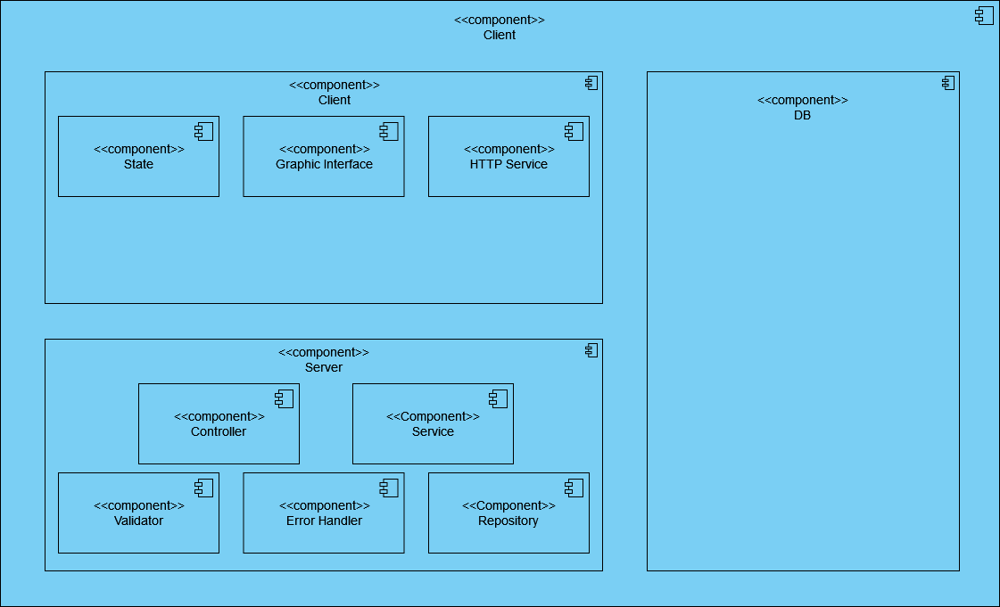
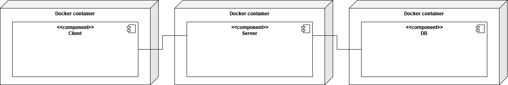
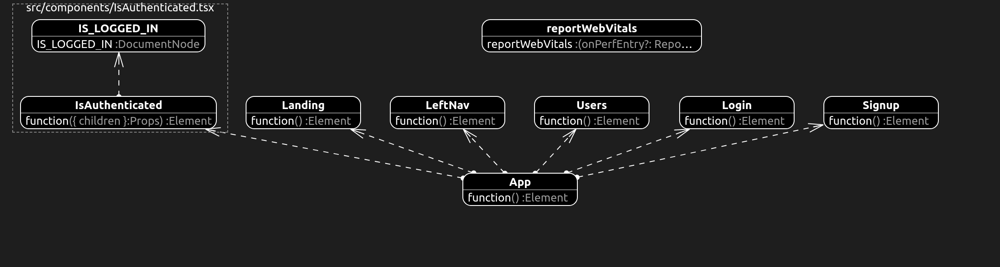
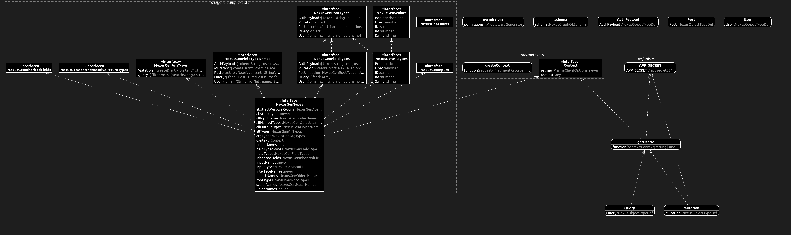

# Scaly-Airship-documentation

## Часть 1

1. Тип приложения - веб-приложение
2. Стратегия развертывания: развертывание Docker-контейнеров на серверах, предоставляемых Digital Ocean
3. Технологии:
- **Frontend:** `To be added`
- **Backend:** `To be added` + `GraphDB`

4. Показатели качества:
- **Качества дизайна**: возможность повторного использования
- **Качества времени выполнения**: масштабируемость
- **Качества системы**: тестируемость
- **Качества взаимодействия с пользователем**: удобство и простота использования

5. Пути реализации сквозной функциональности:
- Инструментирование и протоколирование: 
- Аутентификация: 
- Авторизация: 
- Управление исключениями:
- Связь:
- Кэширование:
- Валидация:

### Диаграмма компонентов

### Диаграмма развертывания

## Часть 2

### Диаграмма Web-классов

### Диаграмма Server-классов

## Часть 3
1. Отличия архитектур "As is" и "To be", и причины:
- Если сравнивать архитектуры в целом (будем рассматривать архитектуры серверной части), то итоговая "As is" архитектура придерживается той реализации, которая изображена на диаграмме компонентов "To be" архитектуры. "As is" архитектура является более детальной, здесь присутствует множество различных контроллеров, сервисов, валидаторов и репозиториев, представленных на "To be" диаграмме компонентов в виде единичных сущностей.

2. Пути улучшения архитектуры:
- Следует принять определенный стиль написания кода и соглашение о присваивании имен для разработки.
- Не смешивать разные типы компонентов на одном логическом уровне
- Максимально изолировать сквозную функциональность от бизнес-логики приложения